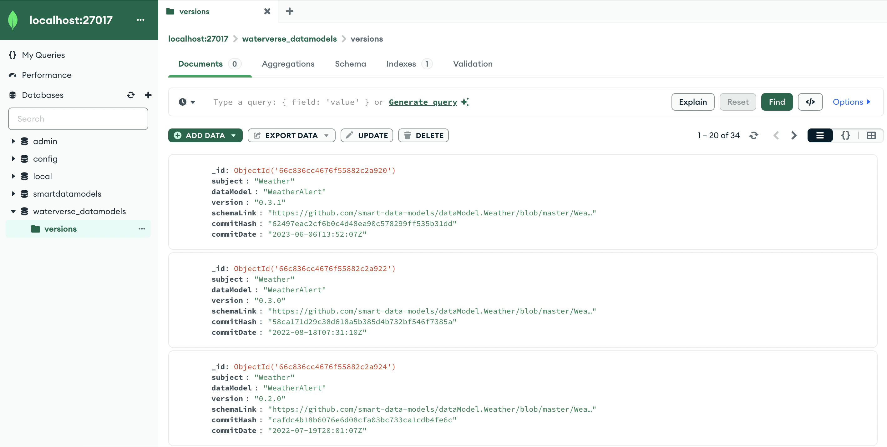

# SDM Versions Manager

## Overview

**sdm-versions-manager** is a Python-based service designed to create a database of Smart Data Models (SDMs) versions.

 It retrieves information about the current version of each data model and its corresponding hash code from a GitHub repository. 
 
 This service aims to facilitate the management and tracking of data model versions, ensuring that users have access to the most up-to-date information.

## Features

- Fetches historical commit data from GitHub for specified data models.
- Extracts version information and commit hashes from the schema files.
- Populates a MongoDB database with the current versions of data models.
- Prevents duplicate entries in the database by checking existing records.

## Requirements

- Python 3.11 or higher
- MongoDB (local or hosted)
- GitHub personal access token (for API access)
- Required Python packages (listed in `requirements.txt`)

## Installation 

1. **Clone the repository**:

   ```bash
   git clone https://github.com/yourusername/sdm-versions-manager.git
   cd sdm-versions-manager
   ```

2. **Create a virtual environment (optional but recommended)**:
    ```bash
    python -m venv venv
    source venv/bin/activate
    ```  

3. **Install the required packages**:
    ```bash
    pip install -r requirements.txt
    ```

4. **Set up environment variables**:

    Create a `.env` file in the root directory of your project with the following content:

    ```text
    GITHUB_TOKEN=your_github_token
    MONGO_URI=mongodb://localhost:27017/
    DB_NAME=your_database_name
    COLLECTION_NAME=your_collection_name
    ```

4. **Configure the data models**:

    Create a `config.json` file in the root directory with the following structure that containes all the data models used in WATERVERSE:

    ```json
    {
        "data_models": [
            ["Weather", "WeatherAlert"],
            ["WaterDistribution", "WaterDistributionNetwork"],
            ["Environment", "WaterObserved"],
            ["Agrifood", "AgriSoil"],
            ["Environment", "PhreaticObserved"],
            ["Environment", "FloodMonitoring"],
            ["WaterDistributionManagementEPANET", "Pipe"],
            ["WaterDistributionManagementEPANET", "Pump"],
            ["WaterDistributionManagementEPANET", "Valve"],
            ["WaterDistributionManagementEPANET", "Junction"],
            ["WaterQuality", "WaterQualityObserved"],
            ["WaterConsumption", "WaterConsumptionObserved"],
            ["Weather", "WeatherObserved"],
            ["WaterQuality", "WaterQualityPredicted"],
            ["Environment", "EnvironmentObserved"]
        ]
    }
    ```

# Usage

## Initial Database Population
To run the script and populate the MongoDB database with the historic and current versions of data models, execute the following command:
```bash
python initial_population.py
```

This script will:

Fetch commit history from the specified GitHub repository.
Parse the schema files to extract version information.
Insert the data into the MongoDB database, avoiding duplicates.

**Data Structure**: 

The data inserted into the MongoDB database will follow this structure:
```json
{
    "subject": "string",
    "dataModel": "string",
    "version": "string",
    "schemaLink": "string",
    "commitDate": "string",
    "commitHash": "string"
}
```
**Mongo Compass**: 

An overview of the populated dataset with SDMs versions data is shown below: 




